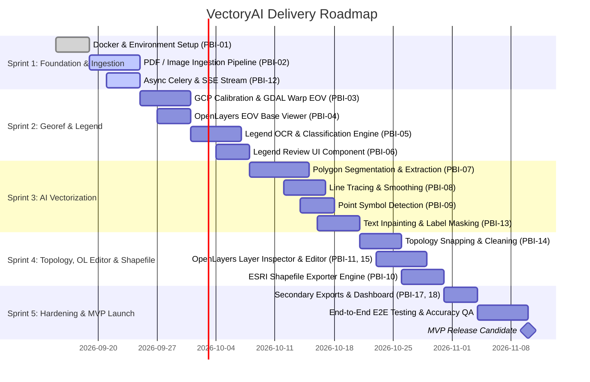

# Product Backlog & Sprint Prioritization: VectoryAI

## 1. Prioritization Methodology (MoSCoW Framework)

To ensure rapid delivery of a functional Minimum Viable Product (MVP) tailored for urban planning professionals, the backlog is structured using the **MoSCoW** prioritization method across phases:

- **Must Have (MVP - Phase 1):** Fundamental capabilities required for end-to-end processing (Upload -> Georeference -> Legend Config -> AI Vectorize -> Single-geometry Shapefile Export).
- **Should Have (Phase 2):** Enhanced productivity features (automatic grid tick detection, in-browser OpenLayers geometry editing, text inpainting refinement).
- **Could Have (Phase 3):** Advanced CAD/DXF export, multi-sheet mosaic merging, batch automated processing.
- **Won't Have (Initial Releases):** 3D building modeling, automated zero-GCP blind georeferencing, direct bidirectional sync with external government portals.

---

## 2. Product Backlog Items (PBI Table)

| ID | Backlog Item Title | Epic | Priority | Est. (SP) | Target Phase | Dependencies | Current Status |
| :--- | :--- | :--- | :---: | :---: | :---: | :--- | :--- |
| **PBI-01** | Project Scaffolding & Dockerized Dev Environment (Next.js + FastAPI + Redis + PostGIS) | Infra | **Must** | 5 | Sprint 1 | - | **Ready** |
| **PBI-02** | High-Res Map Ingestion & PDF to 300 DPI Raster Tiling Engine | Ingestion | **Must** | 8 | Sprint 1 | PBI-01 | **Mostly complete** |
| **PBI-03** | Interactive GCP Georeferencer & GDAL Warping to EOV (EPSG:23700) | Georef | **Must** | 8 | Sprint 2 | PBI-02 | **Mostly complete** |
| **PBI-04** | OpenLayers 9+ Base Map Viewer with Proj4 EOV Support & Overlay Controls | Frontend | **Must** | 5 | Sprint 2 | PBI-03 | **Mostly complete** |
| **PBI-05** | Legend Detection & OCR Parser with Geometry Type Assignment | Legend | **Must** | 8 | Sprint 2 | PBI-02 | **Mostly complete** |
| **PBI-06** | Interactive Legend Review & Color Swatch Calibration UI | Frontend | **Must** | 5 | Sprint 2 | PBI-05 | **Mostly complete** |
| **PBI-07** | Zoning District Polygon Color Segmentation & Contour Vectorization Engine | Vectorizer | **Must** | 13 | Sprint 3 | PBI-05 | **Mostly complete** |
| **PBI-08** | Linear Regulatory Element Skeletonization & Douglas-Peucker Smoothing | Vectorizer | **Must** | 8 | Sprint 3 | PBI-07 | **Mostly complete** |
| **PBI-09** | Point Symbol Detection & Centroid Coordinate Extractor | Vectorizer | **Must** | 5 | Sprint 3 | PBI-07 | **Mostly complete** |
| **PBI-10** | Layer Segregation & ESRI Shapefile Package Generator (.shp, .shx, .dbf, .prj) | Exporter | **Must** | 8 | Sprint 4 | PBI-07, PBI-08 | **Mostly complete** |
| **PBI-11** | OpenLayers Multi-Layer Vector Visualizer with Layer Toggles & Opacity | Frontend | **Must** | 5 | Sprint 4 | PBI-04, PBI-10 | **Mostly complete** |
| **PBI-12** | Celery Asynchronous Job Queue & Real-time Progress Updates (SSE/WS) | Infra | **Must** | 5 | Sprint 1 | PBI-01 | **Mostly complete** |
| **PBI-13** | Morphological Text Inpainting & Label Masking for Hole-Free Polygons | Vectorizer | **Should** | 8 | Sprint 3 | PBI-07 | **Implemented slice** |
| **PBI-14** | Automated Topology Snapping & Sliver Gap Removal Module | Topology | **Should** | 8 | Sprint 4 | PBI-07, PBI-08 | **Mostly complete** |
| **PBI-15** | In-Browser OpenLayers Vector Editor (Draw, Modify, Delete, Snap) | Frontend | **Should** | 8 | Sprint 4 | PBI-11 | **Mostly complete** |
| **PBI-16** | Semi-Automatic EOV Grid Crosshair / Tick Detector | Georef | **Should** | 5 | Sprint 2 | PBI-03 | **Not started** |
| **PBI-17** | Secondary Export Formats (GeoJSON & DXF Package) | Exporter | **Should** | 3 | Sprint 5 | PBI-10 | **Not started** |
| **PBI-18** | User Project Management Dashboard & Recent Jobs History | Frontend | **Should** | 5 | Sprint 5 | PBI-01 | **Not started** |
| **PBI-19** | Fine-Tuned SAM 2 / YOLOv8-seg Urban Planning Model Integration | AI / ML | **Could** | 13 | Phase 2 | PBI-07 | **Not started** |
| **PBI-20** | Multi-Sheet Plan Stitching & Seamless Boundary Merging | Vectorizer | **Could** | 13 | Phase 2 | PBI-14 | **Not started** |

### Status Legend

- **Ready:** Core workflow is implemented and validated with focused tests/builds.
- **Mostly complete:** Main acceptance-critical slice is implemented; real-plan QA, browser coverage, or hardening gaps remain.
- **Implemented slice:** The requested PBI behavior is implemented, but the PBI is not a release-complete production feature.
- **Not started:** No implementation has been completed for the PBI.

---

## 3. Sprint Roadmap & Milestones

### Sprint 1: Project Foundation & Ingestion Engine
- Set up monorepo / service directory structure (Next.js frontend, FastAPI backend, Celery worker).
- Implement robust PDF to 300+ DPI multi-scale raster converter.
- Configure Redis message broker and async worker infrastructure with SSE status tracking.

### Sprint 2: Spatial Georeferencing & AI Legend Extraction
- Build the dual-pane GCP calibration tool in OpenLayers with EOV (EPSG:23700) projection.
- Develop the legend detection and OCR pipeline to extract class codes and names.
- Create the interactive legend validation wizard in React.

### Sprint 3: Core AI Vectorization Engine
- Implement color-space segmentation and contour polygonization.
- Add text inpainting to avoid doughnut holes in zoning districts.
- Implement centerline skeletonization for regulatory boundary lines.
- Implement point symbol locator for isolated landmark elements.

### Sprint 4: Topology Cleaning, OpenLayers Layer Editor & Shapefile Export
- Implement Shapely/GDAL-based topology cleaning (gap filling, snap tolerance, sliver removal).
- Integrate OpenLayers vector editing interactions (modify vertices, split, merge).
- Build the ESRI Shapefile exporter ensuring strict single-geometry type per layer with `.prj` in EPSG:23700.

### Sprint 5: Hardening, Polish & MVP Release
- User project dashboard and history storage in PostgreSQL.
- Validation on real-world municipal regulatory plans (TSZT/SZT test corpus).
- Performance optimization and Docker production profile.

---

## 4. Technical Risks & Mitigation Strategies

| Risk | Impact | Probability | Mitigation Strategy |
| :--- | :---: | :---: | :--- |
| **High Memory Usage on A0 Maps (300 DPI)** | High | High | Implement sliding window tile processing and pyramid image representation. |
| **Text Labels Creating Holes in Polygons** | High | High | Pre-segment text via OCR bounding boxes and apply OpenCV inpainting prior to contour tracing. |
| **Overlapping Dashed / Interrupted Lines** | Medium | Medium | Graph-based skeleton reconstruction (`networkx`) with distance & angle alignment heuristics. |
| **Shapefile Format Geometry Incompatibilities** | High | Low | Enforce strict geometry filters (`shapely.geometry.Polygon`, `LineString`, `Point`) before Fiona writes each file. |
